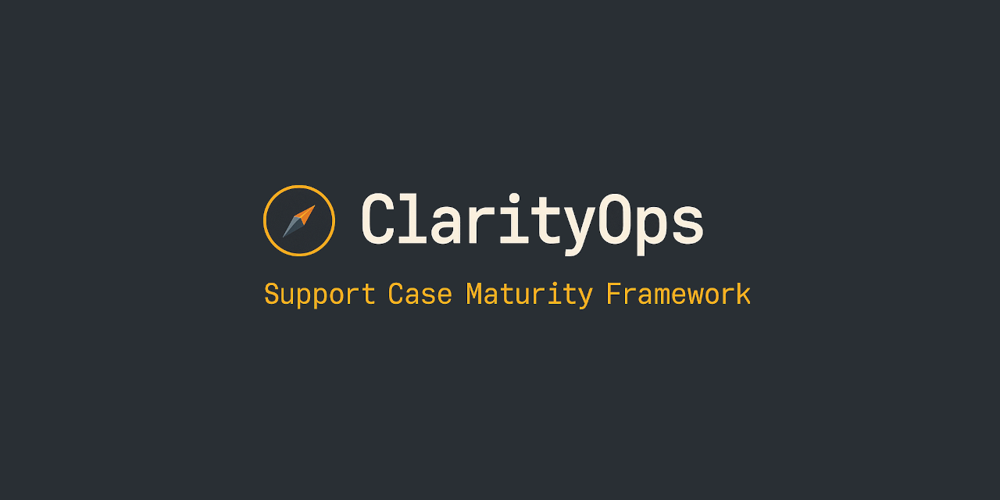

# 🧭 ClarityOps: Support Case Maturity Framework  
### Designing a structure for clarity, validation, and continuous growth  

---

## 🪄 Overview  
**ClarityOps** is an early-stage framework and prototype designed to help support teams improve case quality, consistency, and engineer maturity.  

This phase focuses on **defining the model**, **standardizing deliverables**, and **building tools for onboarding and coaching**. 

It’s built to evolve into a measurable dashboard, but its foundation is a clear, teachable framework for how engineers learn, validate, and communicate in complex customer environments.  

---

## ❗ Problem  

Onboarding for Support Engineers is can be an esoteric process, where technical and customer-facing training are not conducted in tandem. Deliverables beyond KPIs or CSATs can be vague or inconsistently defined, leaving new engineers uncertain about what success looks like. 

ClarityOps establishes a structured path that helps engineers stay focused, validate effectively, and communicate with confidence. It also introduces a maturity map that allows engineers to pursue professional growth intentionally, not merely as a byproduct of tenure or repetition. 

---

## 💡 Objectives  
- Define a **multi-phase troubleshooting framework**: that breaks the support process into clear, teachable stages.  
- Create a **case deliverables checklist** to clarify what "good" looks like for each phase.  
- Develop **maturity milestones** to help engineers self-assess and guide mentorship.  
- Build **templates and documentation** (in Markdown or Notion) that can evolve into automation later.  
- Design a **future dashboard mock-up** showing what observability of process might look like.  

---

## 🧰 Deliverables  
- Framework document (Markdown / PDF)  
- Case Deliverables Checklist  
- Engineer Maturity Milestone Map  
- Sample Runbook and Validation Template  
- Mock Dashboard
- README with reflection on next-phase automation ideas  

---

## 🗓️ Milestones  

| Milestone | Focus | Hours |
|------------|--------|-------|
| **M1: Discovery & Drafting** | Define framework, outline principles | 20 |
| **M2: Deliverables & Templates** | Create case checklist + maturity map | 30 |
| **M3: Visualization Prototype** | Design dashboard mock-ups | 25 |
| **M4: Documentation & Reflection** | Finalize README, retrospective, presentation deck | 25 |

## 🗂️ Project Structure

ClarityOps is organized into modular milestone folders that capture the framework’s evolution, from concept to documentation and prototype design.

ClarityOps/  
`├──` [docs/](docs/README.md)  
`│   ├──` [discovery/](docs/discovery/)  
`│   │   ├──` [overview.md](docs/discovery/overview.md)  
`│   │   ├──` [framework.md](docs/discovery/framework.md)  
`│   │   └──` [notes.md](docs/discovery/notes.md)  
`│   ├──` [templates/](docs/templates/)  
`│   │   ├──` [case_checklist.md](docs/templates/case_checklist.md)  
`│   │   ├──` [maturity_map.md](docs/templates/maturity_map.md)  
`│   │   └──` [feedback.md](docs/templates/feedback.md)  
`│   ├──` visualization/  
`│   │   ├──` mock_dashboard.png  
`│   │   ├──` dashboard_design_notes.md  
`│   │   └──` feature_ideas.md  
`│   ├──` documentation/  
`│       ├──` final_reflection.md  
`│       ├──` retrospective.md  
`│       └──` presentation_outline.md  
`├───────` [resources.md](docs/resources.md)  

---

## 🚀 Impact  
By starting with structure, **ClarityOps** makes the troubleshooting process teachable. It’s a foundation for tools that promote clarity, validation, and confidence in every customer interaction. 
